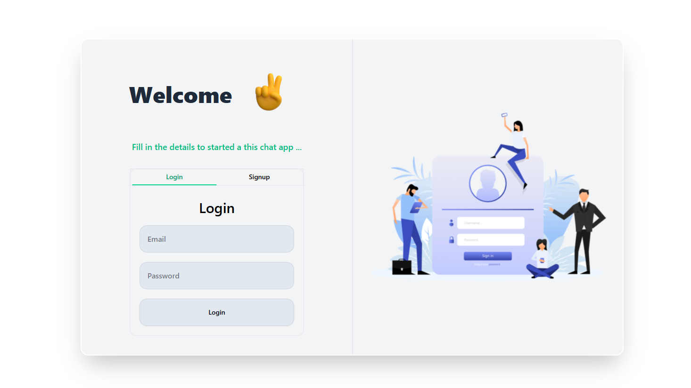
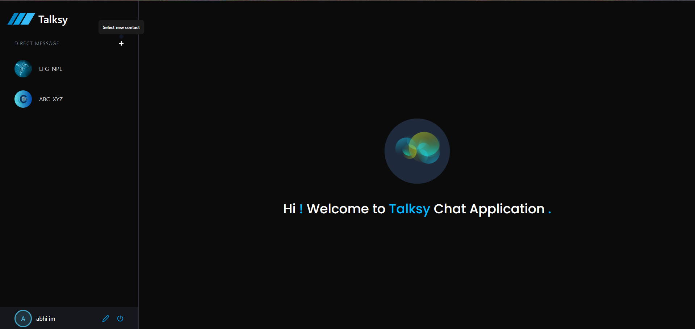
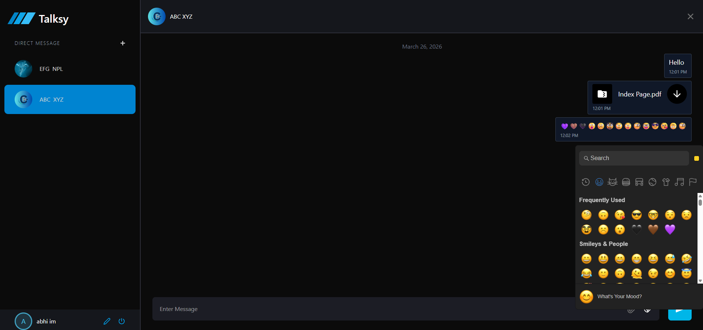
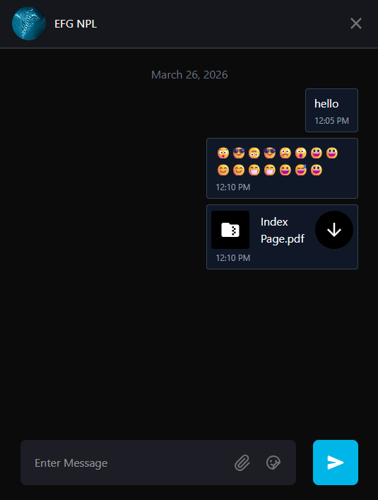

# 💬 MERN Chat Application

A full-stack real-time chat application built using the MERN stack with modern UI and features like emojis, file sharing, and authentication.

---

## 🚀 Features

* 🔐 User Authentication (JWT)
* 💬 Real-time Chat System
* 😊 Emoji Picker Support
* 📁 File Sharing (Images/Documents)
* 🎨 Modern UI (Tailwind + ShadCN + Radix UI)
* 🕒 Message timestamps (Moment.js)
* ⚡ State Management using Zustand

---

## 🛠️ Tech Stack

### Frontend:

* React.js
* Tailwind CSS
* ShadCN UI
* Radix UI
* Zustand
* React Router DOM
* Emoji Picker React
* React Icons
* Lottie Animations

### Backend:

* Node.js
* Express.js
* MongoDB + Mongoose
* JWT Authentication
* Bcrypt (Password Hashing)
* Multer (File Uploads)
* Cookie Parser
* CORS

---

## ⚙️ Environment Variables

### Backend (`/server/.env`)

```
PORT=8383
JWT_SECRET_CODE=your_secret_key
ORIGIN=http://localhost:5173
DATABASE_URL=your_mongodb_url
```

### Frontend (`/client/.env`)

```
VITE_SERVER_URL=http://localhost:8383/
```

---

## 📦 Installation

### Clone the repo

```
git clone https://github.com/your-username/your-repo-name.git
```

### Backend Setup

```
cd server
npm install
npm run dev
```

### Frontend Setup

```
cd client
npm install
npm run dev
```

---

## 📸 Screenshots

### 🔐 Login Page


### 💬 Chat Interface


### 😊 Emoji Picker


### 📁 File Sharing


---

## 📸 Screenshot Captions

### 🔐 Login Page  
User login screen with email and password input fields, showing secure authentication.

### 💬 Chat Interface  
Main chat window displaying conversations with timestamps and user messages.

### 😊 Emoji Picker  
Interactive emoji picker integrated into chat input for expressive messaging.

### 📁 File Sharing  
A user sends a PDF file ("Index Page.pdf") within the chat, showing the file icon, filename, timestamp, and a clear download button for easy access.

---


## 🌟 Future Plans

We plan to enhance the chat application with a **real-time calling feature** in upcoming updates.  

### 🔹 Calling Feature Highlights:
- Real-time **audio and video calls** between users
- Interactive **call UI** with buttons for mute, hang up, and video toggle
- Integration with **WebRTC** for secure peer-to-peer communication
- Signaling handled via **Socket.io** for connection setup
- Smooth handling of **incoming calls, network interruptions, and permissions**

This feature will make the chat application even more **interactive, professional, and closer to real-world messaging apps**.


## 🤝 Contributing

Pull requests are welcome!

---
